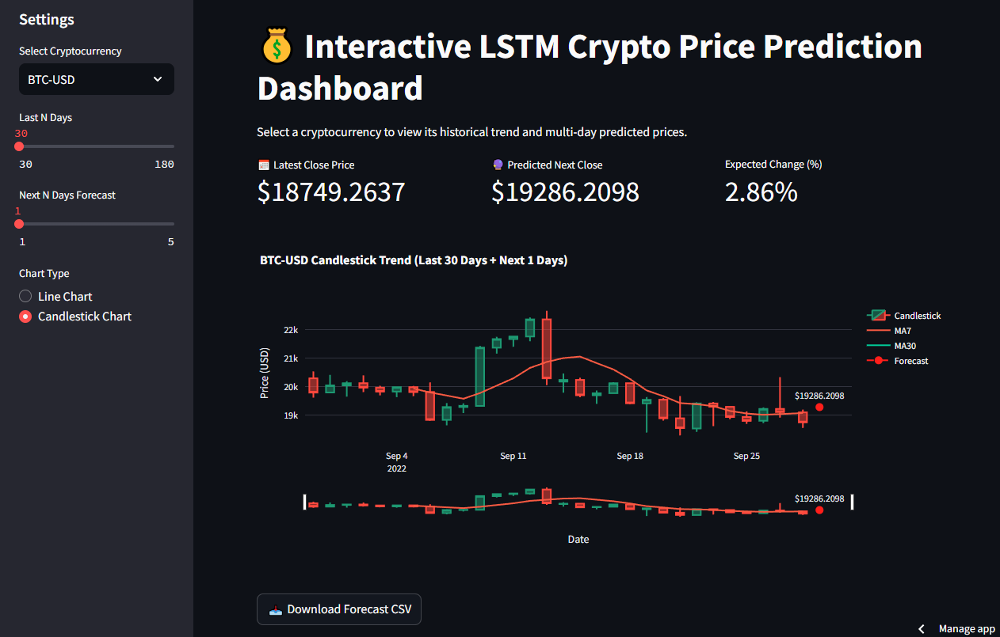

# 💰 Interactive LSTM Crypto Price Prediction Dashboard

  
[](https://www.python.org/)[](https://streamlit.io/)[](https://www.tensorflow.org/)[](LICENSE)

---

## Overview

This is an **Interactive LSTM-based Crypto Price Prediction Dashboard** built with **Streamlit** and **Plotly**. The app provides users with:

* Historical price trends for top cryptocurrencies
* Multi-day future price forecasts using a trained **LSTM model**
* Interactive **line and candlestick charts**
* Downloadable CSV reports for predicted prices

Designed for **crypto enthusiasts, traders, and data science learners**, this app turns raw historical data into actionable insights.

---

## 🗂 Dataset

* Historical price data for **top 5 cryptocurrencies** (2014–2022)
* Sourced from **Kaggle** and preprocessed for model training
* Features used: `open`, `high`, `low`, `close`, `adjclose`, `volume`

---

## 🧠 Model

* **Model Type:** LSTM (Long Short-Term Memory) Neural Network
* **Input:** Last 60 days of historical data
* **Output:** Next N days predicted prices (adjustable via sidebar)
* **Scaling:** Data normalized using **MinMaxScaler**
* **Multi-day Forecast:** Sequential predictions for each future day

---

## ⚙️ Features

* Select cryptocurrency from **top 5 coins**
* Adjust **historical days displayed** (30–180 days)
* Adjust **forecast days** (1–5 days)
* Toggle between **Line Chart** and **Candlestick Chart**
* View **moving averages (MA7, MA30)**
* Download **multi-day forecast as CSV**
* Interactive charts using **Plotly**

---

## 👨‍💻 About the Developer

**Usama Munawar** – Data Scientist | MPhil Scholar | Machine Learning Enthusiast  
Passionate about transforming raw data into meaningful insights and intelligent systems.  
  
🌍 Connect with me:      
[](https://github.com/UsamaMunawarr)[](https://www.linkedin.com/in/abu--usama)[](https://www.youtube.com/@CodeBaseStats)[](https://twitter.com/Usama__Munawar?t=Wk-zJ88ybkEhYJpWMbMheg&s=09)[](https://www.facebook.com/profile.php?id=100005320726463&mibextid=9R9pXO)

💚 Thank you for using this app! Share it with your friends.

---

## 📥 Installation

1. Clone the repository:

```bash
git clone https://github.com/YourUsername/crypto-lstm-dashboard.git
cd crypto-lstm-dashboard
```

2. Create a virtual environment and install dependencies:

```bash
python -m venv venv
source venv/bin/activate  # Linux/Mac
venv\Scripts\activate     # Windows

pip install -r requirements.txt
```

3. Run the Streamlit app:

```bash
streamlit run app.py
```

---

## 🔗 References

* [Kaggle Cryptocurrency Dataset](https://www.kaggle.com)
* TensorFlow/Keras LSTM tutorials
* Plotly documentation for interactive charts
* Streamlit documentation

---

## 📝 License

This project is licensed under the **MIT License** – see the [LICENSE](LICENSE) file for details.

---


